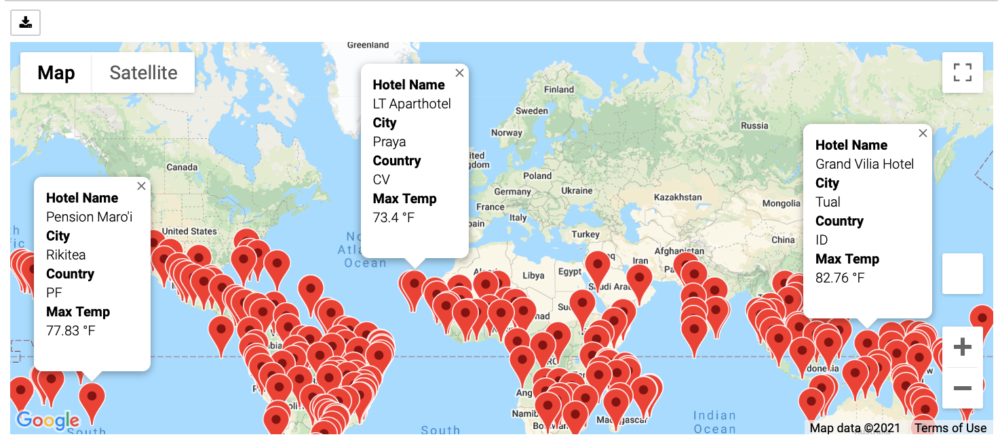
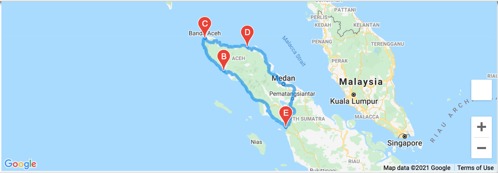
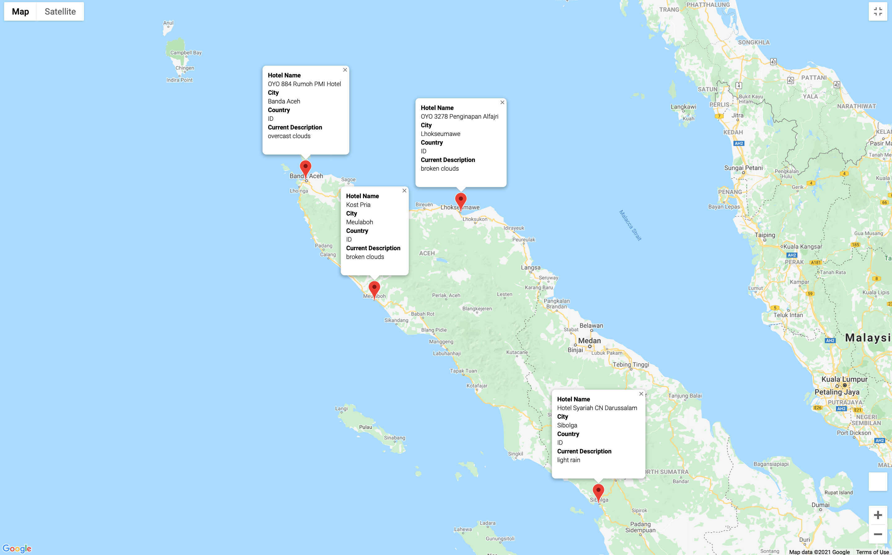

# World_Weather_Analysis
Gathering data on weather patterns from cities around the world using APIs to help customers plan their ideal vacation destinations and itineraries. 

## Overview
The goal of this project is to collect weather data from cities around the world and use this information to help customer's plan their ideal vacation. APIs can be used to gather this information from online weather databases and with the Google Maps API, we can visualize these results on an interactive world-wide map that displays current weather conditions around the world. After gathering this information, customers can input the ideal temperature of their travel destination to narrow down search results to cities that fall in that temperature range. Then, with the Google Places API, we can find nearby hotels for customers to book their stays. Finally, with the Google Directions API, we can help the customer plan a trip itinerary with directions to each hotel so that the final result is a personalized and fully planned vacation itinerary.

## Resources
- OpenWeatherMap API
- Google Maps APIs
- Jupyter Notebook 
- Python (version 3.8.5)

## Example Trip
The following trip is an example of a vacation planned using the resources above. 

In the Vacation_Search.ipynb file under the Vacation_Search folder, the customer is asked to provide a minimum and maximum temperature for the cities they would like to visit. Here, our range is 70-99 degrees Farenheight. This outputs a map with cities across the world that currently fall into that temperature range:

This map contains markers giving the user city names, hotels, country ID, and the maximum temperature. From here, the user can zoom in on the map to explore destinations. Once the user has decided on a country or general location, the Vacation_Itinerary.ipynb file in the Vacation_Itinerary folder can be used to generate a trip itinerary based on nearby cities they would like to visit. The user will specify the start and end location, as well as stops along the way. This will generate a map with driving directions similar to the following:

Lastly, the user can select the markers on the itinerary map to see the name of the hotel, city, country ID, and current description:

